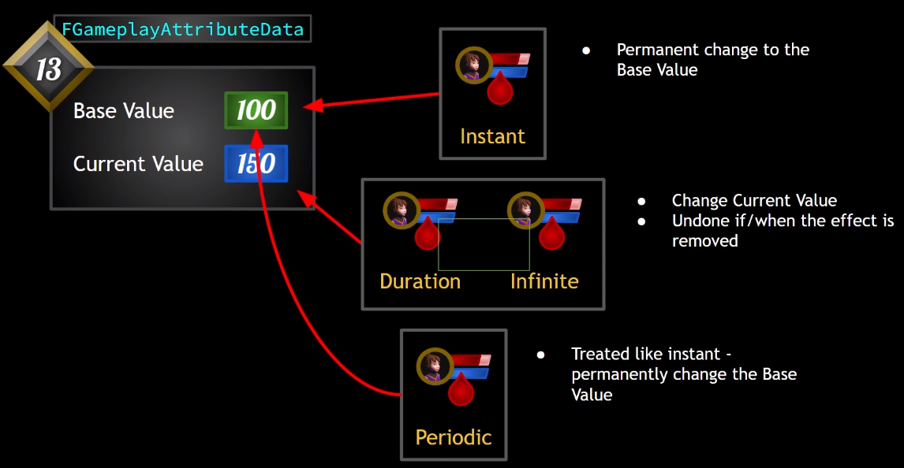

# GAS是啥？

- 全称 `Gameplay Ability System`。处理Attribute和Ability

- GAS的组成
  - `Ability System Component`
  - `Attribute Set`
  - `Gameplay Ability`：是一个类，包括各种方法，可以异步只需各种Ability Tasks
  - `Ability Task`
  - `Gameplay Effect`：修改Attribute值
  - `Gameplay Cue`：粒子特效，声音
  - `Gameplay Tag`

# GAS在项目中的位置

- 先设置两个基础的类，`Ability System Component`和`Attribute Set`
  - 对于玩家，由于在游戏中pawn会不断重生，而且角色类逻辑很多，所以考虑把gas放到Player State类里管理
  - 对于AI，则把GAS直接放到角色类里。


# GAS中的联机

- 这里以Dedicated Server为例
- `GameMode`只存在于Server中
- `PlayerController`在Server上全存在，但在Client上只有玩家自己控制的版本
- `PlayerState`在Server和Client上全存在
- `Pawn`不用说也肯定全存在
- `Pawn`中的变量要同步的话**只能由Server同步到Client**，因此Client上的变量值的改变必须通过**`RPC`**到Server上更新，否则这种改变只有client的自己知道。
- 

- ASC的Replication Mode说明
  - AI用minimal，联机玩家用mixed
  - 

# GAS的初始化

- 我们采用的是左下角和右边的方案
  - 由于我们把gas放到主角的`PlayerState`类里，所以我们必须在角色被`controller` `possess`以后再初始化
  - `PossessedBy`只会在server上调用
  - `OnRep_PlayerState`在客户端上调用时，可以保证`PlayerState`已经被set


# Attribute Set是啥

- 联机下的预测机制，可以消除client与server间的延迟
  - **Prediction**: Client doesn't need to wait for the server's permission to change a value. the value cam change **immediately client-side** and the server is informed of the change. the server can **roll back** changes that are invalid


## BaseValue vs CurrentValue

- 概念

  - BaseValue是属性的永久值
  - CurrentValue是BaseValue基础上应用GE临时的更改

- 注意：通常我们把Max值单独作为一个Attribute，它和base和current都不同

- |         是否修改值          | BaseValue | CurrentValue |
  | :-------------------------: | :-------: | :----------: |
  |         Instant GE          |     √     |              |
  |    Duration&Infinite GE     |           |      √       |
  |        Periodic  GE         |     √     |              |
  |    PreAttributeChange()     |           |      √       |
  | PostGameplayEffectExecute() |     √     |              |

## Clamping操作

- `PreAttributeChange`修改**CurrentValue**
- `PostGameplayEffectExecute`修改**BaseValue**

### PreAttributeChange

- 主要负责AS中在属性修改前对`CurrentValue`的修改，是对CurrentValue做**Clamp**理想的地方
- 对任何`Attributes`的修改都会触发该函数，不管是Setter还是GE
- 注意：在这里进行的任何Clamp操作都不会永久更改 ASC 上的Modifier。它只会改变Modifier的query返回值。

### PostGameplayEffectExecute

- 该函数只会在`Instant GE`修改了`BaseValue`后触发
- **注意**：调用 PostGameplayEffectExecute() 时，属性的更改已经发生，但尚未复制到客户端，因此在此Clamp值不会导致客户端收到两次网络更新。客户端只会在Clamp后收到更新。


# `UE`中的复制

https://docs.unrealengine.com/5.3/en-US/replicate-actor-properties-in-unreal-engine/

# Gameplay Effects是啥

## 介绍


## 几种不同duration policy类型

- 

## Stack GE

- 注意这里的stack和数据结构里的不太一样
  - 加入stack是2，代表最多有两个effect可以同时起作用
- 下面的**source**就是应用GE的ASC，target就是我们的ASC

| Stacking Type       | Description                                                  |
| ------------------- | ------------------------------------------------------------ |
| Aggregate by Source | There is a separate instance of stacks per Source `ASC` on the Target. Each Source can apply X amount of stacks. |
| Aggregate by Target | There is only one instance of stacks on the Target regardless of Source. Each Source can apply a stack up to the shared stack limit. |

- Stack **Duration Refresh Policy**: 这是持续时间的刷新设置
  - 1：每次申请到stack就刷新持续时间，比如是10s，一个GE到剩5s时又应用了GE，此时时间又刷新成10s
  - 2 never fresh：从不刷新
- Stack **Period Reset Policy**：周期时间重置，类似上面的
- Stack **Expiration Policy**：Stack过期设置

## GEDurationType

- - 

## 读源码

- 一次角色捡血瓶加血的流程（instant类型）

  - 角色与球体begin overlap， 触发血瓶actor 里的函数

  - 获取角色身上的ASC，然后根据血瓶的GE class创建GESpecHandle(存放管理GE信息)，然后调用`ApplyGameplayEffectSpecToSelf`把GE应用到我们身上

    - apply函数(ASC类)里执行下面这段：（Apply似乎会把）

      - ```c++
        if (Spec.Def->DurationPolicy == EGameplayEffectDurationType::Instant)
        	{
        		if (OurCopyOfSpec->Def->OngoingTagRequirements.IsEmpty())
        		{
        			ExecuteGameplayEffect(*OurCopyOfSpec, PredictionKey);
        		}
        ```

    - 在`ExecuteGameplayEffect`(ASC类)里执行：

      - ```c++
        ActiveGameplayEffects.ExecuteActiveEffectsFrom(Spec, PredictionKey);
        ```

      - 然后在`ExecuteActiveEffectsFrom`(GE类)里执行:

      - ```c++
        //遍历Modifier
        for (int32 ModIdx = 0; ModIdx < SpecToUse.Modifiers.Num(); ++ModIdx)
        	{
        		const FGameplayModifierInfo& ModDef = SpecToUse.Def->Modifiers[ModIdx];
        		
        		FGameplayModifierEvaluatedData EvalData(ModDef.Attribute, ModDef.ModifierOp, SpecToUse.GetModifierMagnitude(ModIdx, true));
        		ModifierSuccessfullyExecuted |= InternalExecuteMod(SpecToUse, EvalData);
        	}
        ```

      - 然后通过`InternalExecuteMod`(GE类)修改AS里的值

      - ```c++
        ApplyModToAttribute(ModEvalData.Attribute, ModEvalData.ModifierOp, ModEvalData.Magnitude, &ExecuteData);
        ```

      - `ApplyModToAttribute`(GE类)里面就会计算出new值，并更新AS里的值

      - `SetAttributeBaseValue`(GE类)里更新AS的值，注意这里是更新base值

  - 一次角色捡血瓶加血的流程（has duration类型）

    - ```c++
      AppliedEffect = ActiveGameplayEffects.ApplyGameplayEffectSpec(Spec, PredictionKey, bFoundExistingStackableGE);
      ```

    - 里面也是通过set timer来实现

# ASC

## 读头文件，看主要有哪些功能

- Gameplay Abilities相关

- Attribute Set相关

  - 获取/添加/移除Attribute Set
  - 是否存在某个AS
  - get/set GA的cur/base value
  - apply modify to 某个GA

- Gameplay Effect相关

  - Apply GE to Self/Target 应用GE
  - Remove AGE 移除GE
  - 构造make一个GESpec，GEContext
  - Getter
    - 获取GE 计数count
    - 获取stack count
    - 获取GE durationn
    - 获取source/target的tags
  - Time相关
    - 重新计算start time
    - 获取start time ，duration
  - Active GE相关
    - 更新
    - 设置level

  - UI相关（）
    - 获取当前GE的any状态

- callbacks / notifies

- Gameplay tag 相关操作

- System Attributes

- 其它 Helper 函数

- GameplayCues相关

- GameplayAbility相关

  - Ability取消/打断

- Debug
  - 

- Replication
  - 设置Rep mode
  - predict key相关
  - owner actor是否权威authority
  - 是否需要复制record montage信息
  - 复制结束/取消的ability
  - server待激活的能力列表 TArray

- 可选的RPC client->server
  - 

- 输入 处理
  - 用于从输入角度抑制激活能力

- 动画蒙太奇支持
  - 

- 变量部分