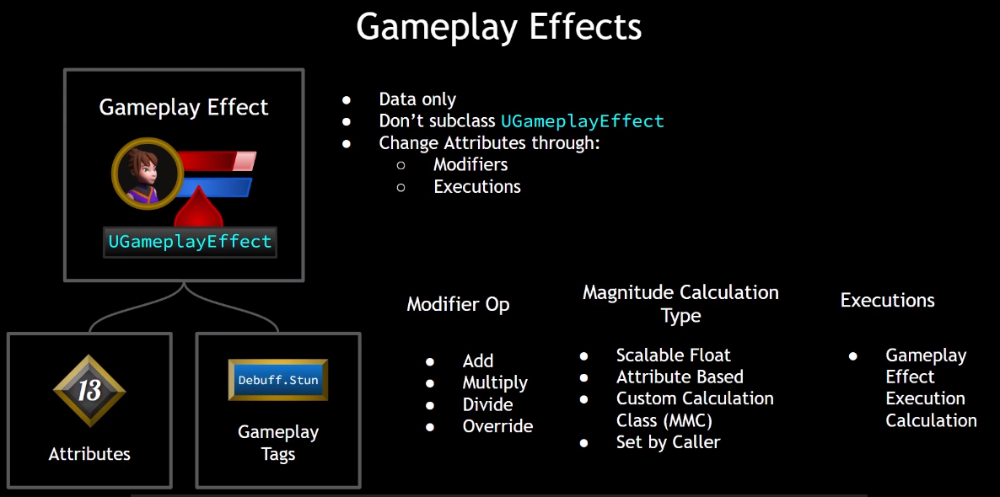
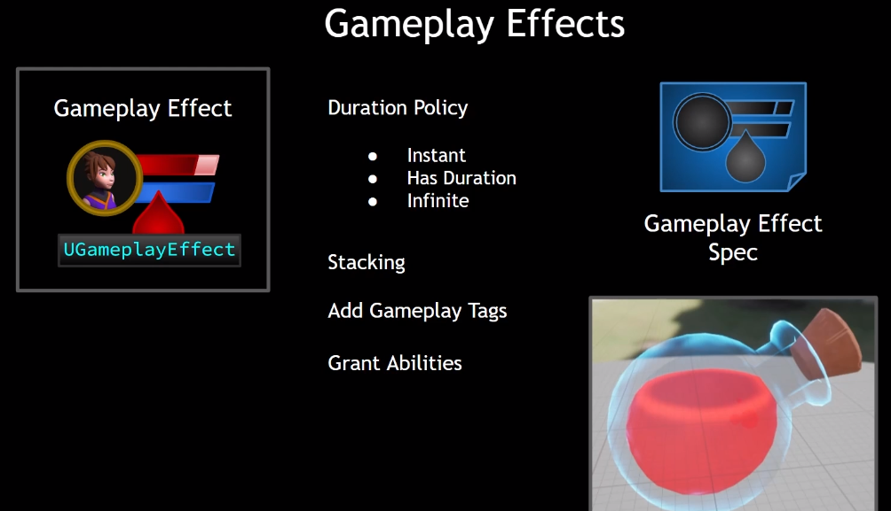

# GAS是啥？

- 全称 `Gameplay Ability System`。处理Attribute和Ability

- GAS的组成
  - `Ability System Component`
  - `Attribute Set`
  - `Gameplay Ability`：是一个类，包括各种方法，可以异步只需各种Ability Tasks
  - `Ability Task`
  - `Gameplay Effect`：修改Attribute值
  - `Gameplay Cue`：粒子特效，声音
  - `Gameplay Tag`

# GAS在项目中的位置

- 先设置两个基础的类，`Ability System Component`和`Attribute Set`
  - 对于玩家，由于在游戏中pawn会不断重生，而且角色类逻辑很多，所以考虑把gas放到Player State类里管理
  - 对于AI，则把GAS直接放到角色类里。


# GAS中的联机

- 这里以Dedicated Server为例
- `GameMode`只存在于Server中
- `PlayerController`在Server上全存在，但在Client上只有玩家自己控制的版本
- `PlayerState`在Server和Client上全存在
- `Pawn`不用说也肯定全存在
- `Pawn`中的变量要同步的话**只能由Server同步到Client**，因此Client上的变量值的改变必须通过**`RPC`**到Server上更新，否则这种改变只有client的自己知道。
- 

- ASC的Replication Mode说明
  - AI用minimal，联机玩家用mixed
  - 

# GAS的初始化

- 我们采用的是左下角和右边的方案
  - 由于我们把gas放到主角的`PlayerState`类里，所以我们必须在角色被`controller` `possess`以后再初始化
  - `PossessedBy`只会在server上调用
  - `OnRep_PlayerState`在客户端上调用时，可以保证`PlayerState`已经被set


# Attribute Set是啥

- 联机下的预测机制，可以消除client与server间的延迟
  - **Prediction**: Client doesn't need to wait for the server's permission to change a value. the value cam change **immediately client-side** and the server is informed of the change. the server can **roll back** changes that are invalid


- 结构长啥样
  - 和act里面的stats结构类似


# `UE`中的复制

https://docs.unrealengine.com/5.3/en-US/replicate-actor-properties-in-unreal-engine/

# Gameplay Effects是啥





- 一次角色捡血瓶加血的流程（instant类型）

  - 角色与球体begin overlap， 触发血瓶actor 里的函数

  - 获取角色身上的ASC，然后根据血瓶的GE class创建GESpecHandle(存放管理GE信息)，然后调用`ApplyGameplayEffectSpecToSelf`把GE应用到我们身上

  - apply函数(ASC类)里执行下面这段：（Apply似乎会把）

    - ```c++
      if (Spec.Def->DurationPolicy == EGameplayEffectDurationType::Instant)
      	{
      		if (OurCopyOfSpec->Def->OngoingTagRequirements.IsEmpty())
      		{
      			ExecuteGameplayEffect(*OurCopyOfSpec, PredictionKey);
      		}
      ```

  - 在`ExecuteGameplayEffect`(ASC类)里执行：

    - ```c++
      ActiveGameplayEffects.ExecuteActiveEffectsFrom(Spec, PredictionKey);
      ```

    - 然后在`ExecuteActiveEffectsFrom`(GE类)里执行:

    - ```c++
      //遍历Modifier
      for (int32 ModIdx = 0; ModIdx < SpecToUse.Modifiers.Num(); ++ModIdx)
      	{
      		const FGameplayModifierInfo& ModDef = SpecToUse.Def->Modifiers[ModIdx];
      		
      		FGameplayModifierEvaluatedData EvalData(ModDef.Attribute, ModDef.ModifierOp, SpecToUse.GetModifierMagnitude(ModIdx, true));
      		ModifierSuccessfullyExecuted |= InternalExecuteMod(SpecToUse, EvalData);
      	}
      ```

    - 然后通过`InternalExecuteMod`(GE类)修改AS里的值

    - ```c++
      ApplyModToAttribute(ModEvalData.Attribute, ModEvalData.ModifierOp, ModEvalData.Magnitude, &ExecuteData);
      ```

    - `ApplyModToAttribute`(GE类)里面就会计算出new值，并更新AS里的值

    - `SetAttributeBaseValue`(GE类)里更新AS的值