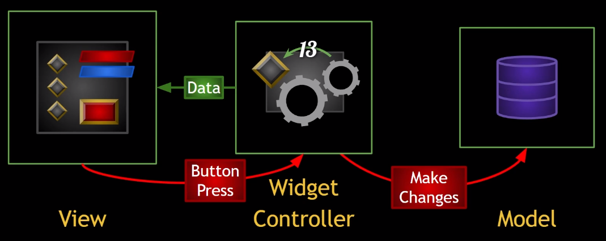
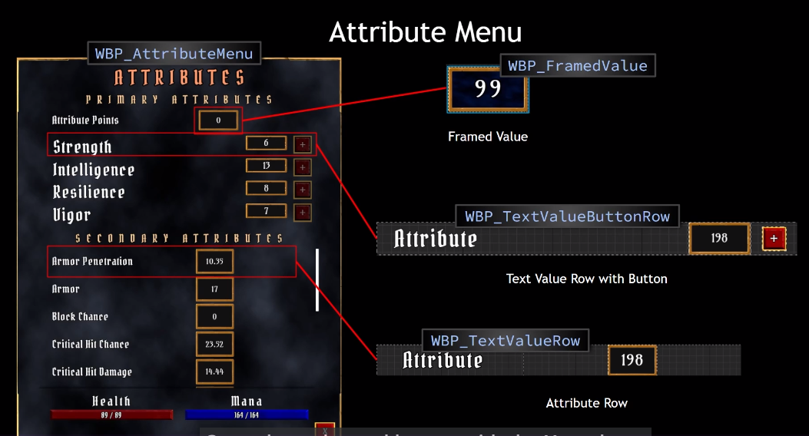

# RPG UI 设计

- 一般分成三部分
  - view是我们看到的
  - controller是中间层，并与view和model**解耦**，即插即用
  - model是存放数据的地方
  - 

- 实施细节
  - View: AuraUserWidget : UserWidget
  - WidgetController: AuraWidgetController : UObject
  - Model: 

- 初始化流程
  - **Character**->**PlayerController**->**HUD**(**InitialOverlay**(初始化OverlayWidget和OverlayWidgetController))
- ui数值更新流程
  - 通过在delegate上绑定函数，更新的数值依次从ASC->widgetController->Widget

# 属性菜单

